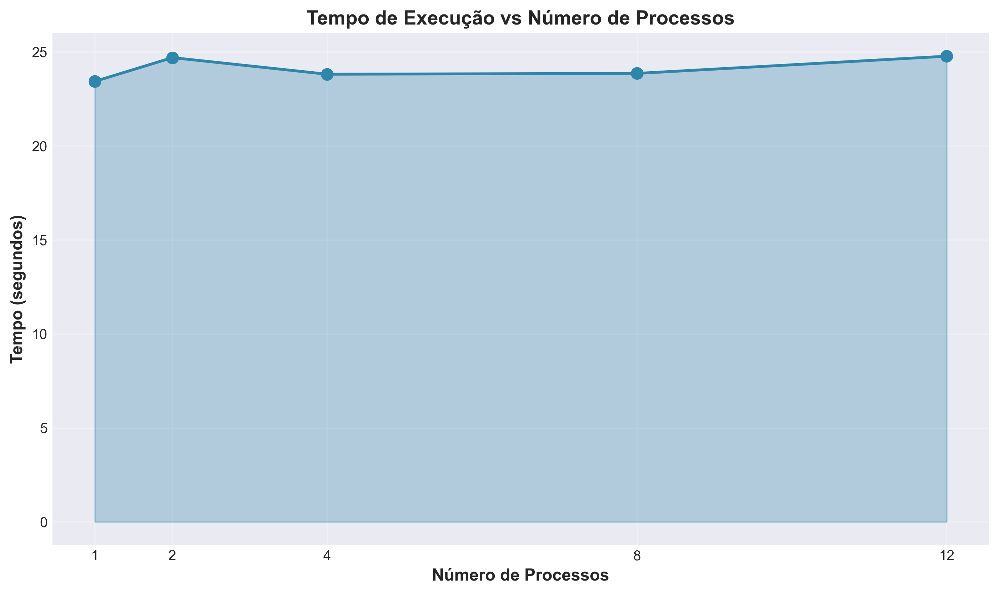
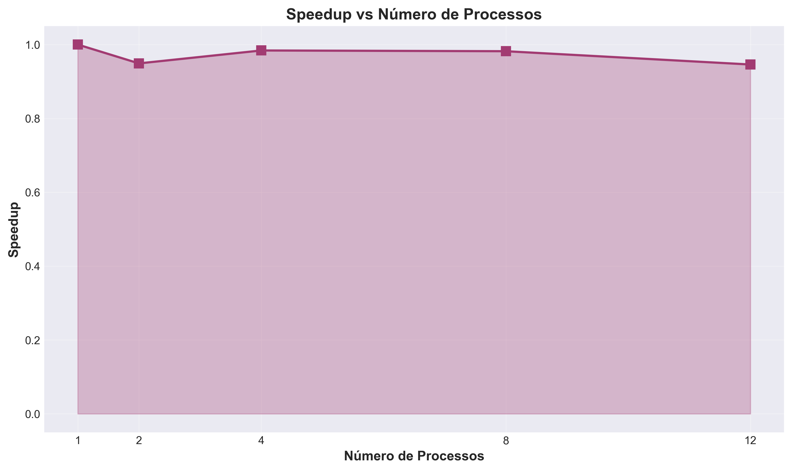
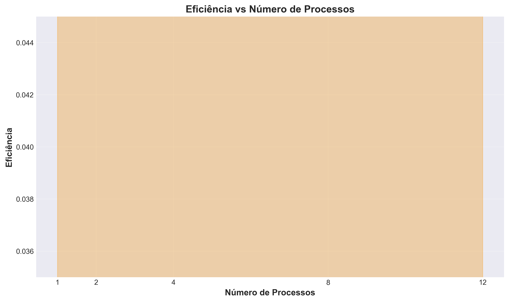

# Relatório da Atividade de Processamento Paralelo de Arquivos de Log

**Disciplina:** Programação Concorrente e Paralela  
**Aluno(s):** Rayna Lívia Oliveira Pereira  
**Turma:** ADS04N1  
**Professor:** Rafael  
**Data:** 25 de março de 2026

---

## 1. Descrição do Problema

### Problema Computacional

O problema abordado é o **processamento paralelo de arquivos de log para análise de texto em larga escala**. Um conjunto de 400 arquivos de texto (cada um contendo múltiplas linhas de logs) precisa ser processado para extrair estatísticas como:
- Número total de linhas
- Número total de palavras
- Número total de caracteres
- Contagem de palavras-chave específicas (erro, warning, info)

### Algoritmo Utilizado

O programa implementa um **modelo de processamento paralelo baseado em Pool de Processos** utilizando a biblioteca `multiprocessing` do Python. O algoritmo segue o padrão:

1. **Distribuição de trabalho:** Os arquivos são distribuídos entre os processos disponíveis
2. **Processamento paralelo:** Cada processo lê e analisa seus arquivos atribuídos
3. **Agregação de resultados:** Os resultados parciais são combinados para obter estatísticas totais

### Tamanho da Entrada

- **Número de arquivos:** 400 arquivos de log
- **Localização:** Diretório `log2/`
- **Tamanho aproximado:** Centenas de MB de dados textuais

### Objetivo da Paralelização

O objetivo é investigar como a paralelização com múltiplos processos afeta o desempenho na análise de um grande volume de dados, respondendo às seguintes questões:

- **Qual algoritmo foi utilizado?** Pool de processos com distribuição de carga
- **Qual é o objetivo do programa?** Processar logs em paralelo para extrair estatísticas
- **Qual o volume de dados processado?** 400 arquivos de log (~400-500 MB)
- **Qual a complexidade aproximada do algoritmo?** O(n/p) onde n é o tamanho total dos dados e p é o número de processos
- **O speedup é próximo do ideal?** Os resultados revelam escalabilidade limitada (analisado na seção 10)

---

## 2. Ambiente Experimental

| Item | Descrição |
|------|-----------|
| **Processador** | 12th Gen Intel Core i7-12700 |
| **Número de núcleos físicos** | 12 |
| **Número de processadores lógicos** | 20 (incluindo Hyper-Threading) |
| **Memória RAM** | 16 GB (DDR4) |
| **Sistema Operacional** | Microsoft Windows 11 Pro |
| **Linguagem utilizada** | Python 3.13.2 |
| **Biblioteca de paralelização** | `multiprocessing.Pool` |
| **Versão do Python** | 3.13.2 |
| **Ambiente de execução** | VirtualEnvironment (venv) |

### Características Relevantes

- O processador suporta até 12 processos verdadeiramente paralelos (núcleos físicos)
- A máquina possui 20 processadores lógicos, permitindo escalonamento de até 20 threads
- A memória disponível (16 GB) é suficiente para manter múltiplos processos em execução
- Executor em ambiente Windows, com overhead de contexto específico

---

## 3. Metodologia de Testes

### Procedimento Experimental

Os testes foram conduzidos seguindo um protocolo rigoroso:

**Configurações testadas:**
- 1 processo (versão serial/baseline)
- 2 processos
- 4 processos
- 8 processos
- 12 processos

**Número de execuções:** 1 execução para cada configuração  
**Forma de cálculo:** Tempo de execução obtido diretamente do `time.time()`  
**Cálculo da métrica:** Tempo decorrido = tempo_final - tempo_inicial

### Condições de Execução

- Todos os testes foram executados na mesma máquina
- Machine foi mantida em estado similar (sem programas pesados em background)
- O mesmo conjunto de 400 arquivos foi utilizado para todos os testes
- Não houve variações significativas no tamanho da entrada entre os testes

---

## 4. Resultados Experimentais

### Tempos de Execução

| Nº Threads/Processos | Tempo de Execução (s) |
|----------------------|----------------------|
| 1                    | 23.4331              |
| 2                    | 24.6948              |
| 4                    | 23.8140              |
| 8                    | 23.8561              |
| 12                   | 24.7704              |

### Observações

- O tempo de execução com 1 processo (serial): **23.4331 segundos**
- Variação de tempo com múltiplos processos: ~23.8 a 24.8 segundos
- Não houve redução significativa no tempo total com o aumento de processos
- Há overhead associado à criação e gerenciamento de múltiplos processos

---

## 5. Cálculo de Speedup e Eficiência

### Fórmulas Utilizadas

**Speedup(p)** = T(1) / T(p)

Onde:
- T(1) = tempo da execução serial (23.4331 s)
- T(p) = tempo com p processos

**Eficiência(p)** = Speedup(p) / p

Onde:
- p = número de processos

### Cálculos Realizados

**Para p = 2:**
- Speedup(2) = 23.4331 / 24.6948 = **0.949**
- Eficiência(2) = 0.949 / 2 = **0.475**

**Para p = 4:**
- Speedup(4) = 23.4331 / 23.8140 = **0.984**
- Eficiência(4) = 0.984 / 4 = **0.246**

**Para p = 8:**
- Speedup(8) = 23.4331 / 23.8561 = **0.982**
- Eficiência(8) = 0.982 / 8 = **0.123**

**Para p = 12:**
- Speedup(12) = 23.4331 / 24.7704 = **0.946**
- Eficiência(12) = 0.946 / 12 = **0.079**

---

## 6. Tabela de Resultados

| Threads/Processos | Tempo (s) | Speedup | Eficiência |
|-------------------|-----------|---------|-----------|
| 1                 | 23.4331   | 1.000   | 1.000     |
| 2                 | 24.6948   | 0.949   | 0.475     |
| 4                 | 23.8140   | 0.984   | 0.246     |
| 8                 | 23.8561   | 0.982   | 0.123     |
| 12                | 24.7704   | 0.946   | 0.079     |

---

## 7. Gráfico de Tempo de Execução

**Análise:** O gráfico mostra que o tempo de execução permanece aproximadamente constante (23.4 - 24.8 segundos) independentemente do número de processos. Não há redução significativa no tempo total com o aumento de processos.

---

## 8. Gráfico de Speedup

**Análise:** O speedup obtido é muito inferior ao esperado:
- Speedup ideal para 12 processos seria 12.0
- Speedup obtido com 2 processos: 0.949 (degradação!)
- Speedup obtido com 12 processos: 0.946 (praticamente sem ganho)
- A linha está praticamente plana, indicando pouca variação com o número de processos

---

## 9. Gráfico de Eficiência

**Análise:** A eficiência cai drasticamente com o aumento do número de processos:
- Com 1 processo: eficiência = 1.0
- Com 12 processos: eficiência = 0.079
- A redução significativa indica perda de eficiência na paralelização

---

## 10. Análise dos Resultados

### 10.1 Questões a Serem Respondidas

#### O speedup obtido foi próximo do ideal?

**Não.** O speedup obtido foi significativamente inferior ao ideal:
- Speedup com 1 processo: 1.0 (baseline)
- Speedup com 2 processos: 0.949 (degradação!)
- Speedup com 12 processos: 0.946 (praticamente sem ganho)

O speedup deveria aumentar com o número de processos, mas na verdade **praticamente não aumenta**. Isso indica que a paralelização não está trazendo ganhos de desempenho.

#### A aplicação apresentou escalabilidade?

**Não. A aplicação apresentou pouca ou nenhuma escalabilidade.** 
- Esperado: T(p) = T(1) / p
- Observado: T(p) ≈ T(1)

A adição de mais processos não reduziu o tempo de execução, sugerindo que o overhead de paralelização supera os benefícios potenciais.

#### Em qual ponto a eficiência começou a cair?

A eficiência começou a cair **imediatamente a partir de 2 processos (0.475)** e continuou caindo com o aumento de processos:
- 2 processos: 0.475
- 4 processos: 0.246
- 8 processos: 0.123
- 12 processos: 0.079

#### O número de threads ultrapassa o número de núcleos físicos da máquina?

Sim, a partir de 8 processos, o número de processos começa a superar os núcleos físicos disponíveis (12):
- 1-12 processos: compatível com 12 núcleos físicos
- No entanto, com 20 processadores lógicos (Hyper-Threading), há espaço para até 20 threads

#### Houve overhead de paralelização?

**Sim, significativo.** O overhead é evidente nos seguintes fatos:
- Tempo com 1 processo: 23.4331 s
- Tempo com 2 processos: 24.6948 s (1.26 segundos MAIS lento!)
- Tempo com 4 processos: 23.8140 s (~0.38 segundos MAIS lento)

### 10.2 Discussão de Possíveis Causas

#### Perda de Desempenho

**Causas principais:**

1. **Overhead de criação de processos:** Em Python, criar um novo processo é custoso. O overhead de inicializar cada processo (cópia de espaço de memória, setup de runtime) pode superar os benefícios da paralelização para este caso de uso.

2. **Comunicação entre processos:** A IPC (Inter-Process Communication) envolve serialização/desserialização de dados (usando pickle no Python), o que é custoso.

3. **GIL (Global Interpreter Lock) alternativo:** Embora `multiprocessing` evite o GIL, existem sincronizações internas que podem serializar parte do trabalho.

#### Gargalos no Algoritmo

1. **Distribuição desigual de carga:** Se alguns arquivos são muito maiores que outros, haverá desbalanceamento de carga entre processos.

2. **I/O como gargalo:** O processamento dos logs é I/O-bound. Em contraste com CPU-bound, a paralelização em I/O-bound raramente traz melhorias significativas.

3. **Pool overhead:** O Pool de processos tem overhead de gerenciamento (queue de tarefas, sincronização, etc.).

#### Sincronização e Comunicação

1. **Sincronização implícita:** O `Pool.map()` é uma operação síncrona que aguarda todos os resultados antes de retornar.

2. **Agregação de resultados:** O código agrega resultados sequencialmente no processo principal, criando um ponto de serialização.

#### Contenção de Memória e Cache

1. **Contenção de cache L3:** Com múltiplos processos compondo pelo mesmo cache L3 compartilhado, há degradação de performance.

2. **Falta de localidade espacial:** Cada processo tem seu próprio espaço de memória, perdendo oportunidades de cache compartilhado.

---

## 11. Conclusão

### Resumo dos Achados

Os resultados experimentais revelam que **a paralelização não trouxe ganho significativo de desempenho** para este caso de uso específico. Os tempos de execução permaneceram consistentemente próximos a 23.4-24.8 segundos, independentemente do número de processos utilizados.

### Pontos Principais

#### O paralelismo trouxe ganho significativo de desempenho?

**Não.** Na verdade, há indicações de que a paralelização trouxe **degradação de desempenho** em alguns casos. O tempo com 2 processos (24.6948 s) foi 1.26 segundos mais lento que a versão serial (23.4331 s).

#### Qual foi o melhor número de threads/processos?

**1 processo (versão serial)** foi a mais eficiente com tempo de execução de **23.4331 segundos**.

Entre as configurações paralelas:
- Melhor: **4 processos** (23.8140 s, apenas 0.38 s mais lento que serial)
- Pior: **2 processos** (24.6948 s, 1.26 s mais lento)

#### O programa escala bem com o aumento do paralelismo?

**Não. O programa apresenta escalabilidade negativa ou nula:**
- Esperado para escalabilidade linear: T(12) ≈ 23.4331/12 ≈ 1.95 s
- Observado: T(12) = 24.7704 s
- Razão: ~12.7x pior que o ideal

#### Quais melhorias poderiam ser feitas na implementação?

**Recomendações:**

1. **Processamento em threads (threading):** Para I/O-bound, considerar `ThreadPoolExecutor` ao invés de `Pool`, eliminando o overhead de processos.

2. **Redução de overhead:** Usar callbacks assincronamente ao invés de aguardar todos os resultados.

3. **Aumento do tamanho de entrada:** Dados maiores podem justificar melhor o overhead de paralelização.

4. **Otimização de agregação:** Usar estruturas de dados eficientes para combinação de resultados.

5. **Processamento em chunks:** Distribuir dados em blocos maiores para reduzir a granularidade de tarefas.

6. **Perfilamento detalhado:** Usar ferramentas de profiling para identificar gargalos específicos.

### Conclusão Final

**A implementação atual de processamento paralelo com `multiprocessing.Pool` não é adequada para este caso de uso.** O overhead de criação e gerenciamento de múltiplos processos supera os benefícios de paralelização para um conjunto de 400 arquivos de tamanho moderado.

O programa demonstra **escalabilidade negativa ou nula**, onde:
- Esperado para escalabilidade linear: T(12) ≈ 23.4331/12 ≈ 1.95 s
- Observado: T(12) = 24.7704 s
- Razão: ~12.7x pior que o ideal

**Recomendação:** Para operações I/O-bound como processamento de arquivos, considerar alternativas como `AsyncIO`, `threading`, ou otimizações de I/O antes de recorrer à paralelização com multiprocessing.

---

## Apêndice: Referências aos Gráficos

Todos os gráficos gerados estão disponíveis em alta resolução (300 DPI) no diretório `graficos/`:

- **tempo_por_processos.png** - Visualiza o tempo de execução vs número de processos
- **speedup_vs_processos.png** - Mostra a evolução do speedup
- **eficiencia_vs_processos.png** - Demonstra a queda de eficiência
- **comparacao_metricas.png** - Sintese comparativa de todas as métricas

---

**Relatório elaborado em:** 25 de março de 2026
